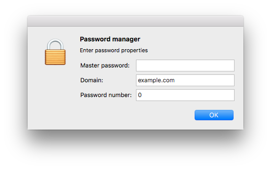

# SimplePass: A simple password manager

_SimplePass_ is a simple password manager based on
[this](https://news.ycombinator.com/item?id=14777049) HackerNews comment. It
creates a strong random password for each service individually and allows you to
increment a counter for services that require you to change the password
periodically.

## Parameters

1. `Master_password`: This is a strong password you never store anywhere.
See [this XKCD](https://xkcd.com/936) for more information on how to choose this password.
1. `Domain`: The name of the service to generate a password for.
1. `Number`: The number of the password, increment when required to change passwords.

## Building

To build this app you will need `pyobjc` and `py2app`. Install them with pip:

    pip install pyobjc py2app

Then build with

    py2applet SimplePass.py
